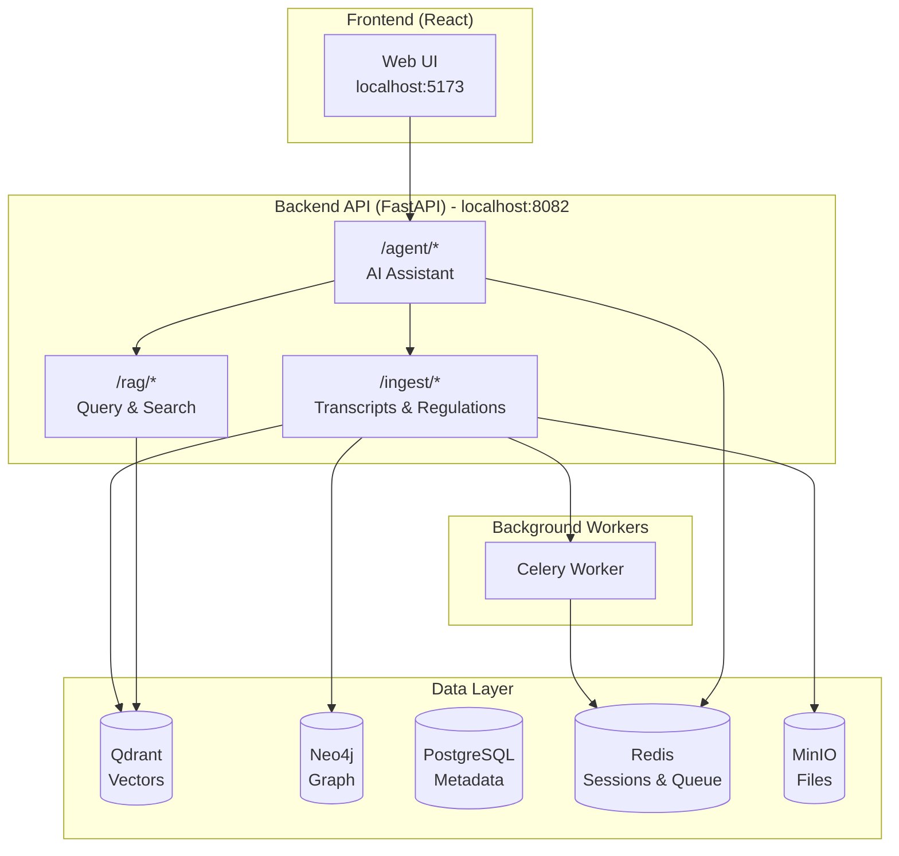

# Shorui-AI

**HIPAA Compliance Assistant** — AI-powered clinical transcript analysis with PHI detection and regulatory grounding.


## Overview

Shorui-AI is a full-stack AI application that helps healthcare organizations analyze clinical transcripts for HIPAA compliance. It features an **intelligent agent** that can automatically detect Protected Health Information (PHI), identify potential violations, query HIPAA regulations, and provide remediation recommendations.

### Key Features

- **🤖 AI Agent** — Conversational interface powered by ReAct agent with specialized compliance tools
- **🔍 PHI Detection** — Uses Microsoft Presidio to identify 18+ types of PHI (names, SSN, MRN, dates, etc.)
- **📋 Compliance Analysis** — OpenAI-powered analysis with structured compliance reports
- **📚 RAG-Powered Q&A** — Ask questions about HIPAA regulations with cited sources
- **📝 Audit Trail** — Complete logging of all PHI detection and access events
- **🔗 Graph Storage** — Neo4j knowledge graph for entity relationships
- **🏢 Multi-tenant** — Project-based isolation for enterprise use

## Architecture



## Quick Start

### Prerequisites

- **Docker Desktop** — [Download here](https://www.docker.com/products/docker-desktop/)
- **Node.js 18+** — Install via [Homebrew](https://brew.sh): `brew install node`
- **uv** (Python package manager) — `brew install uv` or `pip install uv`
- **OpenAI API Key** — [Get one here](https://platform.openai.com/api-keys)

### 1. Clone and Setup

```bash
# Clone the repository
git clone https://github.com/yourusername/shorui-ai.git
cd shorui-ai

# Copy environment template
cp .env.example .env

# Edit .env and add your OpenAI API key
# Required: Set OPENAI_API_KEY=sk-your-key-here
nano .env  # or: code .env / vim .env
```

### 2. Start Backend Services

```bash
# Install Python dependencies
uv sync

# Start all Docker services (first run takes ~5 minutes to build)
uv run poe start-build

# Wait for services to initialize (~30 seconds)
sleep 30

# Verify backend is running
curl http://localhost:8082/health
```

### 3. Seed HIPAA Regulations

```bash
# Load HIPAA regulation PDFs from docs/ folder into vector database
uv run poe seed
```

### 4. Start Frontend

```bash
cd frontend
npm install
npm run dev
```

### 5. Open the App

Navigate to **http://localhost:5173** in your browser.

You'll see the HIPAA Compliance Assistant with example action chips:
- 📄 Analyze a clinical transcript
- 🔍 Ask about HIPAA encryption requirements  
- 📋 Check audit logs for PHI

---

## Using the Application

### Analyze Clinical Transcripts

1. Click the **📎 paperclip** button in the chat input
2. Select a `.txt` file containing clinical transcript text
3. Type "analyze this transcript for HIPAA compliance" (or it will auto-prompt)
4. Wait for analysis (5-30 seconds)
5. View the formatted compliance report with:
   - Risk level (LOW/MEDIUM/HIGH/CRITICAL)
   - PHI detection summary (names, dates, IDs found)
   - Violation details with remediation recommendations

### Ask About HIPAA Regulations

Simply type questions like:
- "What are HIPAA's requirements for data encryption?"
- "Explain the minimum necessary standard"
- "What are the penalties for HIPAA violations?"

The agent will search the indexed HIPAA regulations and provide grounded answers.

### Query Audit Logs

Ask questions about system activity:
- "Show me recent PHI detection events"
- "What transcripts were analyzed today?"

---

## Poe Commands

The project uses [Poe the Poet](https://github.com/nat-n/poethepoet) for task running:

```bash
uv run poe --help        # Show all available commands

# Development
uv run poe test          # Run unit tests
uv run poe test-quick    # Run tests (stop on first failure)
uv run poe e2e           # Run end-to-end tests
uv run poe e2e-quick     # Run quick health check only
uv run poe lint          # Check code style
uv run poe format        # Format code

# Infrastructure
uv run poe start         # Start all Docker services
uv run poe start-build   # Start with full rebuild
uv run poe stop          # Stop all services
uv run poe restart       # Restart all services
uv run poe logs          # Follow backend logs
uv run poe logs-worker   # Follow Celery worker logs

# Data
uv run poe seed          # Seed HIPAA regulations from docs/
uv run poe setup         # Full setup: build, start, and seed

# Utilities
uv run poe health        # Check API health
uv run poe qdrant-stats  # Get Qdrant collection stats
```

---

## API Endpoints

### Agent (`/agent/...`)

| Method | Endpoint | Description |
|--------|----------|-------------|
| `POST` | `/agent/sessions` | Create new agent session |
| `POST` | `/agent/sessions/{id}/messages` | Send message (with optional file upload) |

### Ingestion (`/ingest/...`)

| Method | Endpoint | Description |
|--------|----------|-------------|
| `GET` | `/health` | Health check |
| `POST` | `/documents` | Upload documents (general or HIPAA regulations) |
| `GET` | `/documents/{job_id}/status` | Check document processing status |
| `POST` | `/clinical-transcripts` | Upload transcript for compliance analysis |
| `GET` | `/clinical-transcripts/jobs/{job_id}` | Check transcript analysis status |
| `GET` | `/clinical-transcripts/{id}/compliance-report` | Get stored compliance report |
| `GET` | `/hipaa-regulations/stats` | Get regulation collection stats |
| `GET` | `/audit-log` | Query audit events |

### RAG (`/rag/...`)

| Method | Endpoint | Description |
|--------|----------|-------------|
| `GET` | `/health` | Health check |
| `POST` | `/query` | Full RAG: retrieve + generate answer |
| `GET` | `/search` | Search documents without LLM |

---

## Services

| Service | Port | Purpose |
|---------|------|---------|
| Backend API | 8082 | FastAPI application |
| Frontend | 5173 | React/Vite dev server |
| Qdrant | 6335 | Vector database |
| Neo4j | 7474/7687 | Graph database |
| PostgreSQL | 5432 | Relational database |
| Redis | 6379 | Session storage & task queue |
| MinIO | 9000/9001 | Object storage |
| Flower | 5555 | Celery monitoring |
| PgAdmin | 5050 | PostgreSQL admin |

---

## Project Structure

```
shorui-ai/
├── app/                    # FastAPI backend
│   ├── main.py            # Application entry point
│   ├── agent/             # AI Agent service (ReAct agent)
│   │   ├── routes.py      # Agent API endpoints
│   │   ├── service.py     # Sync session management (Redis)
│   │   └── async_service.py  # Async session management (in-memory)
│   ├── compliance/        # HIPAA compliance services
│   │   └── services/      # PHI detection, reports, audit
│   ├── ingestion/         # Document/transcript ingestion
│   │   ├── routes.py      # API endpoints
│   │   └── services/      # Business logic
│   ├── rag/               # RAG query service
│   └── workers/           # Celery async tasks
├── agents/                # ReAct agent implementation
│   └── react_agent/       # Custom agent with tools
│       ├── agent.py       # ReActAgent core
│       ├── tools/         # Agent tools (compliance, regulation lookup)
│       └── core/          # Models, memory, prompts
├── frontend/              # React frontend
│   └── src/
│       ├── App.tsx        # Main app (unified agent interface)
│       ├── api/           # API clients
│       └── components/    # UI components
├── shorui_core/           # Shared domain models
│   ├── config.py          # Settings
│   ├── domain/            # Pydantic schemas
│   └── infrastructure/    # Database connectors
├── scripts/               # Utility scripts
│   ├── e2e_test.py       # End-to-end test suite
│   └── extract_safe_harbor.py  # PDF extraction utility
├── tests/                 # Unit and integration tests
├── docs/                  # HIPAA regulation PDFs (for seeding)
├── docker-compose.yml     # Service definitions
├── Dockerfile            
└── pyproject.toml         # Python dependencies + Poe tasks
```

---

## Configuration

### Environment Variables

| Variable | Required | Description |
|----------|----------|-------------|
| `OPENAI_API_KEY` | Yes | OpenAI API key for LLM |
| `OPENAI_MODEL_ID` | No | Model to use (default: `gpt-4o-mini`) |
| `POSTGRES_PASSWORD` | No | PostgreSQL password (default: `postgres`) |

### Sample Transcripts

Test files are included in the repository:
- `sample_transcript.txt` — Basic clinical transcript
- `sample_transcript_1.txt` — Transcript with various PHI types

---

## Development

### Running Tests

```bash
# Run unit tests
uv run poe test

# Run end-to-end tests (requires Docker services running)
uv run poe e2e

# Run quick smoke tests
uv run poe e2e-quick

# Run with coverage
uv run pytest tests/ -v --cov=app
```

### Local Development (without Docker)

```bash
# Install Python deps with uv
uv sync

# Start only infrastructure services with Docker
docker compose up -d qdrant neo4j postgres redis minio

# Run backend locally
uv run uvicorn app.main:app --reload --port 8082

# Run frontend (in separate terminal)
cd frontend && npm run dev
```

---

## Troubleshooting

### Backend not starting

1. Check Docker logs: `uv run poe logs`
2. Ensure all services are up: `docker compose ps`
3. Verify `.env` file exists with valid `OPENAI_API_KEY`

### Transcript analysis timing out

1. Check Celery worker is running: `docker compose ps worker`
2. Check Redis is running: `docker compose ps redis`
3. View worker logs: `uv run poe logs-worker`

### Frontend can't connect to backend

1. Ensure backend is running on port 8082
2. Check browser console for CORS errors

### "No documents found" in regulation queries

1. Ensure you've seeded HIPAA regulations: `uv run poe seed`
2. Check Qdrant is running: `docker compose ps qdrant`

### E2E tests failing

1. Run quick health check: `uv run poe e2e-quick`
2. Ensure services are running: `uv run poe start`
3. Seed regulations if needed: `uv run poe seed`

