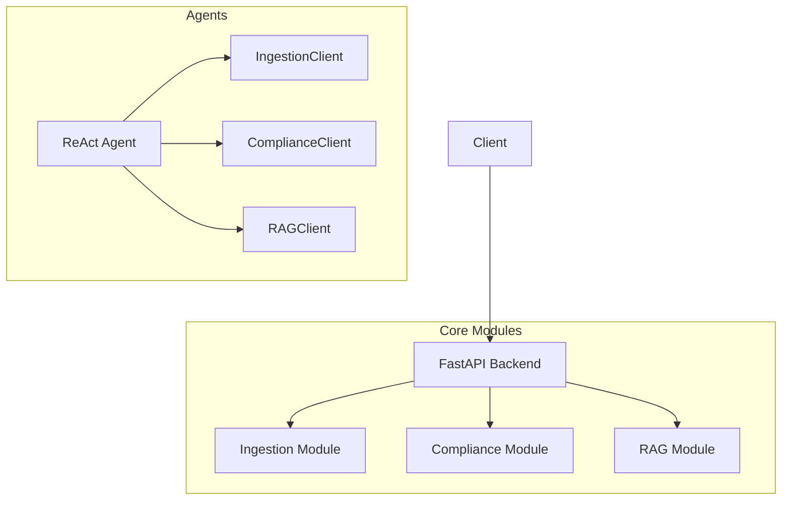

# Shorui-AI

**HIPAA Compliance Assistant** — AI-powered clinical transcript analysis with PHI detection and regulatory grounding.


## 📖 Overview

Shorui-AI is a modular, scalable platform for ingesting, analyzing, and reasoning about clinical transcripts and HIPAA regulations. It combines:
-   **Agents**: Autonomous ReAct agents for user interaction.
-   **RAG**: Retrieval Augmented Generation for grounded answers.
-   **Graph Tech**: Neo4j for structural knowledge and relationships.
-   **Compliance**: Microsoft Presidio for PHI detection and masking.

The system is designed to provide a secure, compliant environment for healthcare data analysis.

---

## 🗺️ Architecture

The system follows a **Microservice-like Monolith** architecture. Modules are loosely coupled via protocols and HTTP clients.



For a detailed architectural deep-dive, see [specs/README.md](specs/README.md).

---

## 🧩 Key Components

| Component | Responsibility | Spec File |
| :--- | :--- | :--- |
| **Agents** | Autonomous reasoning and user interaction (LangGraph). | [specs/agents.md](specs/agents.md) |
| **Compliance** | HIPAA validation, PHI detection, and audit logging. | [specs/compliance.md](specs/compliance.md) |
| **Ingestion** | Document upload, chunking, embedding, and storage. | [specs/ingestion.md](specs/ingestion.md) |
| **RAG** | Retrieval implementation (Vector + Graph). | [specs/rag.md](specs/rag.md) |
| **Workers** | Async background processing (Celery). | [specs/workers.md](specs/workers.md) |
| **Core** | Shared protocols, config, and infrastructure. | [specs/shorui_core.md](specs/shorui_core.md) |

---

## 🚀 Quick Start

### Prerequisites
-   **Docker Desktop**
-   **Node.js 18+**
-   **uv** (Python package manager)
-   **OpenAI API Key**

### 1. Setup
```bash
git clone https://github.com/yourusername/shorui-ai.git
cd shorui-ai
cp .env.example .env
# Add your OPENAI_API_KEY to .env
```

### 2. Run
```bash
# Sync dependencies
uv sync

# Build and start all services
uv run poe start-build

# Seed HIPAA regulations
uv run poe seed
```

### 3. Access
-   **Frontend**: http://localhost:5173
-   **API**: http://localhost:8082
-   **Docs**: http://localhost:8082/docs

---

## 🛠️ Development

We use `poe` (Poe the Poet) for task management.

```bash
uv run poe --help        # Show all commands
uv run poe test          # Run unit tests
uv run poe e2e           # Run end-to-end tests
uv run poe lint          # Check code style
uv run poe logs          # View backend logs
```

For detailed endpoints and service configurations, refer to the specific **Spec Files** linked above.
