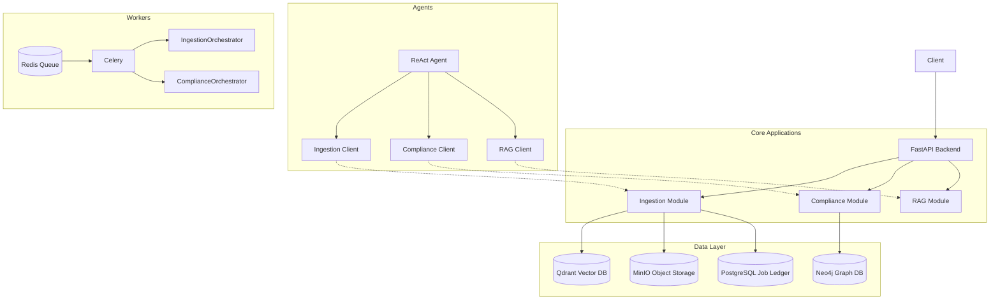

# Shorui AI Project Specification

This directory contains the definitive technical specifications for the **Shorui AI** platform. This file serves as the master index and context map for the entire project.

**Goal**: To provide a modular, scalable platform for ingesting, analyzing, and reasoning about clinical transcripts and HIPAA regulations using Agents, RAG, and Graph technologies.

---

## 🗺️ Architecture Overview

The system follows a **Microservice-like Monolith** architecture. Modules are loosely coupled via protocols and HTTP clients, allowing for future extraction into separate services.

---

## 📚 Module Index

| Module | Directory | Spec File | Primary Responsibility |
| :--- | :--- | :--- | :--- |
| **Agents** | `agents/` | [agents.md](./agents.md) | Autonomous ReAct agent handling user interaction and reasoning. |
| **Compliance** | `app/compliance/` | [compliance.md](./compliance.md) | HIPAA validation, PHI detection (Presidio), and audit logging. |
| **Ingestion** | `app/ingestion/` | [ingestion.md](./ingestion.md) | Document uploading, chunking, embedding, and storage. |
| **RAG** | `app/rag/` | [rag.md](./rag.md) | Retrieval Augmented Generation (Hybrid Search + Graph Reasoning). |
| **Workers** | `app/workers/` | [workers.md](./workers.md) | Async background processing (Celery) for long-running tasks. |
| **Core** | `shorui_core/` | [shorui_core.md](./shorui_core.md) | Shared infrastructure, protocols, configuration, and exceptions. |

---

## 📂 Codebase Map

Quick reference for where key logic resides.

*   **`app/`**: Main FastAPI application logic.
    *   **`ingestion/services/pipeline.py`**: The main document processing pipeline.
    *   **`compliance/services/privacy_extraction.py`**: Orchestrator for PHI analysis.
    *   **`rag/services/retrieval.py`**: The RAG retrieval orchestrator.
*   **`agents/`**: Standalone Agent logic (LangGraph).
    *   **`react_agent/agent.py`**: The Agent class and tool binding.
*   **`shorui_core/`**: Shared foundation.
    *   **`domain/interfaces.py`**: Critical Protocols defining service contracts.
    *   **`infrastructure/`**: Singleton connectors (Neo4j, Qdrant).

---

## 🔑 Key Architectural Patterns

*   **Pointer-Based Storage**: Sensitive data (PHI) is **never** stored in the Graph/Vector DB. It is encrypted in Blob Storage (MinIO), and only a pointer (URI) is stored in the database. (See [compliance.md](./compliance.md))
*   **Protocol-Oriented Design**: Services communicate via abstract `Protocols` defined in `shorui_core` or local `protocols.py`, not concrete classes. This enables easy mocking and swapping of backends.
*   **Thin Task Architecture**: Celery tasks (`app/workers`) are minimal wrappers. They immediately delegate all logic to domain **Orchestrators** (e.g., `IngestionOrchestrator`), ensuring business logic is not coupled to the async framework.
*   **ReAct Loop**: The Agent uses a "Reason + Act" loop implemented via **LangGraph**, treating the backend modules as external tools accessible via HTTP.

---

## 🛠️ Technology Stack

*   **Language**: Python 3.11+
*   **Web Framework**: FastAPI
*   **Async Processing**: Celery + Redis
*   **Vector DB**: Qdrant
*   **Graph DB**: Neo4j
*   **Object Storage**: MinIO
*   **LLM Orchestration**: LangGraph (Agents), OpenAI API (Direct)
*   **PHI Detection**: Microsoft Presidio
