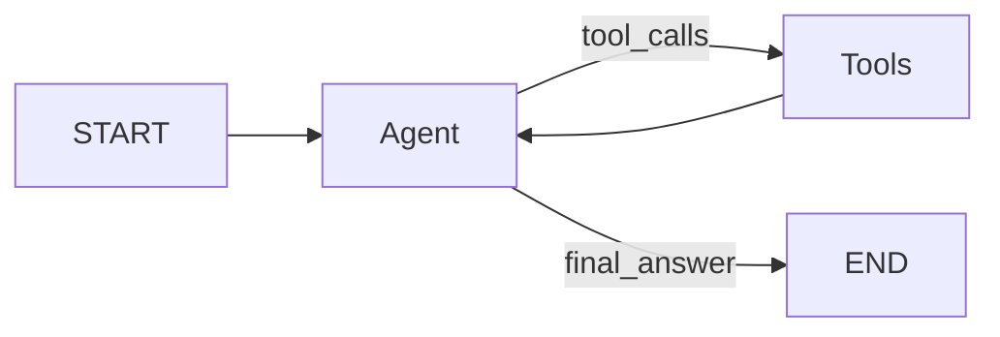

# Agents Module Specification

This document describes the agents module architecture, specifically the ReAct agent implementation.

## Overview

The `agents` module provides a standalone **ReAct (Reasoning + Acting)** agent built on **LangGraph**. It acts as an autonomous assistant capable of:

-   **Reasoning**: Decomposing user queries (System Prompt).
-   **Acting**: Using tools to interact with backend services (RAG, Compliance, Ingestion).
-   **Observing**: Processing tool outputs to generate grounded responses.
-   **Persisting**: Maintaining multi-turn conversation state via Redis.

---

## Module Structure

-   `agents/react_agent/agent.py`: `ReActAgent` class (Model + Tools binding)
-   `agents/react_agent/workflow.py`: LangGraph definition & Checkpointing
-   `agents/react_agent/state.py`: `AgentState` definition
-   `agents/react_agent/core/`:
    -   `base_state.py`: Base TypedDict state
    -   `model_factory.py`: LLM instantiation logic
    -   `prompts.py`: System prompts
-   `agents/react_agent/infrastructure/clients/`: HTTP Clients for backend services
    -   `ingestion.py`: Document ingestion client
    -   `rag.py`: RAG retrieval client
    -   `compliance.py`: Compliance analysis client
    -   `health.py`: Health check client
-   `agents/react_agent/tools/`:
    -   `rag_retrieval.py`: HIPAA Regulation tool
    -   `clinical_transcript.py`: Transcript Analysis tool

---

## Architecture: ReAct Loop

The agent follows the ReAct pattern implemented as a cyclic graph:



### Components

-   **Agent** (`ReActAgent`): Orchestrates the LLM, binds tools, and manages the system prompt.
    -   **Source**: [agent.py](../agents/react_agent/agent.py)
-   **Workflow** (`AgentWorkflow`): Defines the LangGraph nodes (`agent`, `tools`) and edges. Manages Redis checkpointing.
    -   **Source**: [workflow.py](../agents/react_agent/workflow.py)
-   **State** (`AgentState`): TypedDict containing `messages` (history) and `iterations` (loop counter).
    -   **Source**: [state.py](../agents/react_agent/state.py)

---

## Tools

The agent is equipped with LangChain-compatible tools that map to backend services.

-   **`search_regulations`**: Queries HIPAA regulations using RAG.
    -   **Implementation**: `rag_retrieval.py`
    -   **Service Used**: RAG Service
    -   **Source**: [rag_retrieval.py](../agents/react_agent/tools/rag_retrieval.py)
-   **`analyze_clinical_transcript`**: Submits transcripts for PHI detection & compliance analysis.
    -   **Implementation**: `clinical_transcript.py`
    -   **Service Used**: Compliance/Ingestion
    -   **Source**: [clinical_transcript.py](../agents/react_agent/tools/clinical_transcript.py)

---

## Infrastructure: HTTP Clients

The agent communicates with backend microservices via strongly-typed HTTP clients.

-   **Compliance Client** (`compliance.py`)
    -   **URL Env Var**: `COMPLIANCE_SERVICE_URL`
    -   **Capabilities**: `/clinical-transcripts`, `/audit-log`
    -   **Source**: [compliance.py](../agents/react_agent/infrastructure/clients/compliance.py)
-   **RAG Client** (`rag.py`)
    -   **URL Env Var**: `RAG_SERVICE_URL`
    -   **Capabilities**: `/rag/search`, `/rag/query`
    -   **Source**: [rag.py](../agents/react_agent/infrastructure/clients/rag.py)
-   **Ingestion Client** (`ingestion.py`)
    -   **URL Env Var**: `INGESTION_SERVICE_URL`
    -   **Capabilities**: `/documents` (Uploads)
    -   **Source**: [ingestion.py](../agents/react_agent/infrastructure/clients/ingestion.py)
-   **Health Client** (`health.py`)
    -   **URL Env Var**: N/A
    -   **Capabilities**: Aggregates health checks
    -   **Source**: [health.py](../agents/react_agent/infrastructure/clients/health.py)

**Note**: All clients support both synchronous (`Client`) and asynchronous (`AsyncClient`) usage.

---

## Usage

### Direct Invocation (Async)

```python
from agents.react_agent.workflow import AgentWorkflow

workflow = AgentWorkflow(redis_url="redis://localhost:6379/0")

# Invoke
result = await workflow.invoke_async(
    user_input="Analyze this transcript for PHI.",
    thread_id="session-123"
)

# Stream
async for state in workflow.stream_async("Query...", thread_id="session-123"):
    print(state)
```

### Configuration

Key settings controlled via environment variables:

-   **`CELERY_BROKER_URL`**: Default Redis URL for checkpointing (Default: `redis://redis:6379/0`)
-   **`OPENAI_API_KEY`**: API Key for the generic model factory (Required)
-   **Service URLs**: Base URLs for internal services (Default: `http://localhost:80XX`)

---

## State Management

State is managed via `AgentState`:

```python
class AgentState(TypedDict):
    messages: Annotated[list[AnyMessage], add_messages] # Reducer appends messages
    iterations: int                                     # Preventive loop counter
```

-   **Checkpointing**: The `AsyncRedisSaver` persists this state using the `thread_id` configuration key, allowing for resumption of conversations across server restarts (stateless API).
