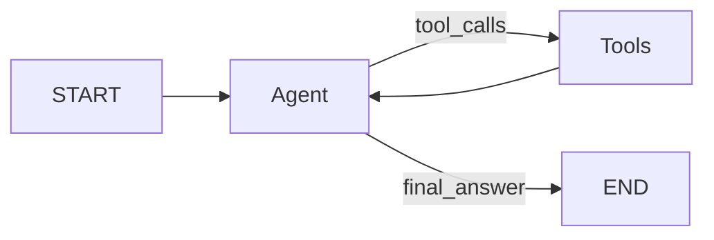

# Agents Module Specification

This document describes the agents module architecture, specifically the ReAct agent implementation.

## Overview

The `agents` module provides a standalone **ReAct (Reasoning + Acting)** agent built on **LangGraph**. It acts as an autonomous assistant capable of:

1.  **Reasoning**: Decomposing user queries (System Prompt).
2.  **Acting**: Using tools to interact with backend services (RAG, Compliance, Ingestion).
3.  **Observing**: Processing tool outputs to generate grounded responses.
4.  **Persisting**: Maintaining multi-turn conversation state via Redis.

---

## Module Structure

```
agents/react_agent/
├── agent.py               # ReActAgent class (Model + Tools binding)
├── workflow.py            # LangGraph definition & Checkpointing
├── state.py               # AgentState definition
├── core/
│   ├── base_state.py      # Base TypedDict state
│   ├── model_factory.py   # LLM instantiation logic
│   └── prompts.py         # System prompts
├── infrastructure/
│   └── clients/           # HTTP Clients for backend services
│       ├── ingestion.py   # Document ingestion client
│       ├── rag.py         # RAG retrieval client
│       ├── compliance.py  # Compliance analysis client
│       └── health.py      # Health check client
└── tools/
    ├── rag_retrieval.py       # HIPAA Regulation tool
    └── clinical_transcript.py # Transcript Analysis tool
```

---

## Architecture: ReAct Loop

The agent follows the ReAct pattern implemented as a cyclic graph:



### Components

| Component | Class | Responsibility |
|-----------|-------|----------------|
| **Agent** | `ReActAgent` | Orchestrates the LLM, binds tools, and manages the system prompt. |
| **Workflow** | `AgentWorkflow` | Defines the LangGraph nodes (`agent`, `tools`) and edges. Manages Redis checkpointing. |
| **State** | `AgentState` | TypedDict containing `messages` (history) and `iterations` (loop counter). |

---

## Tools

The agent is equipped with LangChain-compatible tools that map to backend services.

| Tool Name | Function | Description | Service Used |
|-----------|----------|-------------|--------------|
| `search_regulations` | `rag_retrieval.py` | Queries HIPAA regulations using RAG. | RAG Service |
| `analyze_clinical_transcript` | `clinical_transcript.py` | Submits transcripts for PHI detection & compliance analysis. | Compliance/Ingestion |

---

## Infrastructure: HTTP Clients

The agent communicates with backend microservices via strongly-typed HTTP clients located in `infrastructure/clients/`.

| Client (`.py`) | Service URL (Env Var) | Key Capabilities |
|----------------|-----------------------|------------------|
| `compliance.py` | `COMPLIANCE_SERVICE_URL` | `/clinical-transcripts`, `/audit-log` |
| `rag.py` | `RAG_SERVICE_URL` | `/rag/search`, `/rag/query` |
| `ingestion.py` | `INGESTION_SERVICE_URL` | `/documents` (Uploads) |
| `health.py` | N/A | Aggregates health checks |

**Note**: All clients support both synchronous (`Client`) and asynchronous (`AsyncClient`) usage.

---

## Usage

### Direct Invocation (Async)

```python
from agents.react_agent.workflow import AgentWorkflow

workflow = AgentWorkflow(redis_url="redis://localhost:6379/0")

# Invoke
result = await workflow.invoke_async(
    user_input="Analyze this transcript for PHI.",
    thread_id="session-123"
)

# Stream
async for state in workflow.stream_async("Query...", thread_id="session-123"):
    print(state)
```

### Configuration

Key settings controlled via environment variables:

| Setting | Default | Description |
|---------|---------|-------------|
| `CELERY_BROKER_URL` | `redis://redis:6379/0` | Default Redis URL for checkpointing |
| `OPENAI_API_KEY` | Required | API Key for the generic model factory |
| Service URLs | `http://localhost:80XX` | Base URLs for internal services |

---

## State Management

State is managed via `AgentState`:

```python
class AgentState(TypedDict):
    messages: Annotated[list[AnyMessage], add_messages] # Reducer appends messages
    iterations: int                                     # Preventive loop counter
```

**Checkpointing**: The `AsyncRedisSaver` persists this state using the `thread_id` configuration key, allowing for resumption of conversations across server restarts (stateless API).
