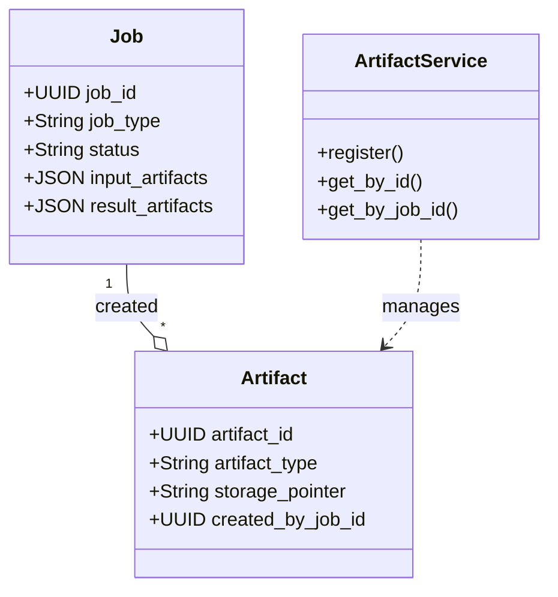

# Artifacts & Jobs Implementation

This document describes the implemented canonical artifacts and jobs model as specified in [component_artifacts_and_jobs.md](./component_artifacts_and_jobs.md).

**Status**: Implemented ✅ (P0 Requirements)

---

## Overview

The system now enforces a canonical model for tracking asynchronous jobs and their artifacts. This replaces ad-hoc job tracking in individual modules with a unified `jobs` ledger and `artifacts` registry in `shorui_core`.

This design provides:
- **Unified Job Tracking**: All async workloads (ingestion, compliance, RAG) use the `jobs` table
- **Canonical Artifact Registry**: All inputs/outputs are registered in the `artifacts` table
- **Cross-Module Queryability**: Artifacts can be looked up by ID, type, or creating job
- **Standardized Statuses**: `pending`, `processing`, `completed`, `failed`, `skipped`

---

## Architecture



---

## Core Module (`shorui_core.artifacts`)

The implementation is centralized in `shorui_core/artifacts/`:

### 1. Domain Models

**Source**: `shorui_core/artifacts/models.py`

```python
class ArtifactType(str, Enum):
    RAW_UPLOAD = "raw_upload"
    INGESTION_RESULT = "ingestion_result"
    TRANSCRIPT = "transcript"
    COMPLIANCE_REPORT = "compliance_report"
    # ...

class JobStatus(str, Enum):
    PENDING = "pending"
    PROCESSING = "processing"
    # ...

class Artifact(BaseModel):
    artifact_id: str
    tenant_id: str
    artifact_type: ArtifactType
    storage_pointer: str
    # ...
```

### 2. Job Types

**Source**: `shorui_core/artifacts/job_types.py`

```python
class JobType(str, Enum):
    INGESTION_DOCUMENT = "ingestion_document"
    COMPLIANCE_TRANSCRIPT = "compliance_transcript"
    # ...
```

### 3. Artifact Service

**Source**: `shorui_core/artifacts/artifact_service.py`

Provides singleton access to the registry:

```python
from shorui_core.artifacts import get_artifact_service

service = get_artifact_service()
artifact_id = service.register(
    tenant_id="default",
    project_id="my-project",
    artifact_type=ArtifactType.TRANSCRIPT,
    storage_pointer="s3://..."
)
```

---

## Integration

### Ingestion Module

The `JobLedgerService` now delegates artifact registration to `ArtifactService`:

```python
# app/ingestion/services/job_ledger.py

def register_artifact(self, ...):
    return get_artifact_service().register(...)
```

### Compliance Module

The `ComplianceOrchestrator` registers both transcripts and reports as canonical artifacts, ensuring they are discoverable alongside ingestion artifacts:

```python
# app/compliance/services/orchestrator.py

# 1. Register Transcript
self.artifact_service.register(
    artifact_type=ArtifactType.TRANSCRIPT,
    storage_pointer=storage_pointer,
    artifact_id=transcript_id,
    ...
)

# 2. Register Report
self.artifact_service.register(
    artifact_type=ArtifactType.COMPLIANCE_REPORT,
    storage_pointer=f"postgres:compliance_reports:{report_id}",
    artifact_id=report_id,
    ...
)
```

### Workers

Async task decorators now enforce `JobType` usage:

```python
@track_job_ledger(
    content_arg="text", 
    job_type=JobType.COMPLIANCE_TRANSCRIPT
)
def analyze_clinical_transcript(...):
```

---

## Database Schema

The `init-db.sql` schema supports this model with:
- `jobs` table (primary ledger)
- `artifacts` table (registry)
- FK constraints linking artifacts to creation jobs

---

## Testing

New unit tests in `tests/shorui_core/artifacts/` verify:
- Enum consistency
- Model validation
- CRUD operations for artifacts

Existing integration tests for Ingestion and Compliance were updated to ensure no regressions.
