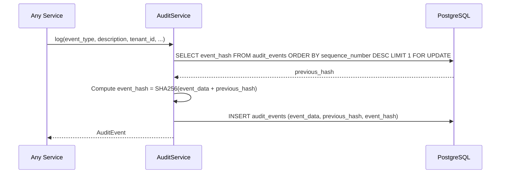

# Audit Ledger Implementation

This document describes the implemented tamper-evident audit logging as specified in [component_audit_ledger.md](./component_audit_ledger.md).

**Status**: Implemented ✅ (P0 Requirements)

---

## Overview

The audit ledger provides HIPAA-compliant, tamper-evident logging of security events. Each audit event is hash-chained to its predecessor, making any modification detectable. Events are tenant-scoped and PHI-safe by design.

This design provides:
- **Tamper Evidence**: SHA-256 hash chain links each event to its predecessor
- **PHI Safety**: Allowlist-based metadata filtering prevents accidental PHI leakage
- **Tenant Scoping**: All events are namespaced by `tenant_id` and `project_id`
- **Chain Verification**: Offline integrity checking via `verify_chain_integrity()`

---

## Architecture Flow



---

## Database Schema

Updated in [init-db.sql](../db/init-db.sql):

```sql
CREATE TABLE IF NOT EXISTS audit_events (
    id UUID PRIMARY KEY,
    sequence_number SERIAL,
    tenant_id VARCHAR(255) NOT NULL,      -- Added
    project_id VARCHAR(255) NOT NULL,     -- Added
    event_type VARCHAR(50) NOT NULL,
    description TEXT NOT NULL,
    user_id VARCHAR(100),
    user_ip VARCHAR(45),
    resource_type VARCHAR(100),
    resource_id VARCHAR(255),
    timestamp TIMESTAMPTZ NOT NULL DEFAULT NOW(),
    metadata JSONB DEFAULT '{}',
    previous_hash VARCHAR(64),            -- Hash chain link
    event_hash VARCHAR(64) NOT NULL       -- This event's hash
);

CREATE INDEX IF NOT EXISTS idx_audit_events_tenant_project ON audit_events(tenant_id, project_id);
```

---

## Implementation Details

### AuditService

**Source**: [audit_service.py](../app/compliance/services/audit_service.py)

Key methods:

```python
class AuditService:
    async def log(
        self,
        event_type: AuditEventType,
        description: str,
        tenant_id: str,           # Required
        project_id: str,          # Required
        resource_type: str = None,
        resource_id: str = None,
        user_id: str = None,
        user_ip: str = None,
        metadata: dict = None,    # Filtered by allowlist
    ) -> AuditEvent

    async def query_events(
        self,
        tenant_id: str,           # Required filter
        project_id: str,          # Required filter
        event_type: AuditEventType = None,
        limit: int = 100,
    ) -> list[dict]

    async def verify_chain_integrity(
        self,
        tenant_id: str = None,
        project_id: str = None,
    ) -> tuple[bool, list[str]]   # (is_valid, error_messages)
```

### Hash Chain Implementation

```python
def _compute_event_hash(self, event_data: dict, previous_hash: str | None) -> str:
    """SHA-256 of canonical JSON + previous hash."""
    canonical = json.dumps(event_data, sort_keys=True, default=str)
    hash_input = (previous_hash or "") + canonical
    return hashlib.sha256(hash_input.encode()).hexdigest()
```

### PHI-Safe Metadata Allowlist

Only these metadata keys are permitted:

```python
ALLOWED_METADATA_KEYS = frozenset({
    "count", "phi_count", "violation_count", "risk_level",
    "job_id", "transcript_id", "report_id", "document_type",
    "byte_size", "items_indexed", "processing_time_ms",
    "detector", "model_version", "request_id",
})
```

All other keys are silently filtered out with a warning log.

### Updated Domain Model

**Source**: [hipaa_schemas.py](../shorui_core/domain/hipaa_schemas.py)

Added event types:
```python
class AuditEventType(str, Enum):
    # Existing
    PHI_DETECTED = "PHI_DETECTED"
    PHI_ACCESSED = "PHI_ACCESSED"
    # ...
    # Added
    TRANSCRIPT_UPLOADED = "TRANSCRIPT_UPLOADED"
    DOCUMENT_INGESTED = "DOCUMENT_INGESTED"
    COMPLIANCE_REPORT_GENERATED = "COMPLIANCE_REPORT_GENERATED"
```

Added tenant scoping to `AuditEvent`:
```python
class AuditEvent(BaseModel):
    id: str
    tenant_id: str    # Added
    project_id: str   # Added
    event_type: AuditEventType
    # ...
```

---

## PHI Safety

| Data | Stored In | PHI Risk |
|:-----|:----------|:--------:|
| Event description | PostgreSQL | ❌ Generic text only |
| Metadata | PostgreSQL | ❌ Allowlist-filtered |
| user_id, user_ip | PostgreSQL | ❌ System identifiers |
| resource_id | PostgreSQL | ❌ UUIDs only |

---

## Testing

### Unit Tests

**12 audit service tests** covering:

| Test Class | Coverage |
|:-----------|:---------|
| `TestAuditServiceInit` | No runtime DDL |
| `TestAuditLog` | Hash-chaining, tenant params |
| `TestMetadataValidation` | PHI-safe allowlist |
| `TestAuditQuery` | Tenant-scoped queries |
| `TestHashComputation` | Deterministic hashing |

Run tests:
```bash
uv run pytest tests/app/compliance/test_audit_service.py -v
```

Full compliance suite (72 tests):
```bash
uv run pytest tests/app/compliance/ -v
```

### Manual Verification

```bash
# Query audit events directly
docker exec -it postgres psql -U shorui -d shorui -c \
  "SELECT id, event_type, tenant_id, project_id, description, event_hash 
   FROM audit_events ORDER BY sequence_number DESC LIMIT 5;"

# Verify hash chain integrity (future: expose via API)
# Currently available as AuditService.verify_chain_integrity()
```

---

## Files Changed

| File | Change | Description |
|:-----|:-------|:------------|
| `db/init-db.sql` | Modified | Added `tenant_id`, `project_id` columns + index |
| `shorui_core/domain/hipaa_schemas.py` | Modified | New event types, tenant fields on `AuditEvent` |
| `app/compliance/services/audit_service.py` | Rewritten | Hash-chaining, PHI-safe metadata, no DDL |
| `app/compliance/services/hipaa_graph_ingestion.py` | Modified | Pass tenant/project to audit calls |
| `tests/app/compliance/test_audit_service.py` | Rewritten | New tests for hash-chaining |

---

## Future Work (P1/P2)

- [ ] Alembic migrations for schema versioning
- [ ] REST API endpoint for `verify_chain_integrity()`
- [ ] Wire up all new event types in callers
- [ ] Periodic chain verification cron job
