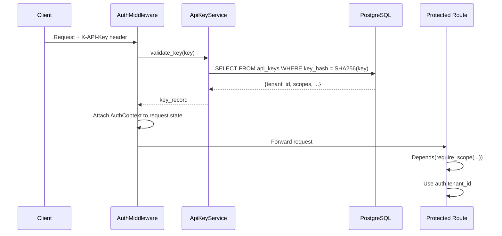

# Auth/Tenant Isolation Implementation

This document describes the implemented authentication and tenant isolation as specified in [component_auth_tenant_isolation.md](./component_auth_tenant_isolation.md).

**Status**: Implemented ✅ (P0 Requirements)

---

## Overview

The auth system provides API key-based authentication with tenant-scoped authorization. Each API key is bound to a tenant, and `tenant_id` is derived server-side from the authenticated key—never from client input.

This design provides:
- **API Key Authentication**: SHA-256 hashed keys via `X-API-Key` header
- **Tenant Derivation**: `tenant_id` bound to key, not client-supplied
- **Scope-Based Authorization**: `ingest:write`, `compliance:read`, `audit:read`, `rag:read`
- **Dev Mode**: `REQUIRE_AUTH=false` bypasses auth with default context

---

## Architecture Flow



---

## Database Schema

Added to [init-db.sql](../db/init-db.sql):

### `tenants` Table

```sql
CREATE TABLE IF NOT EXISTS tenants (
    tenant_id VARCHAR(255) PRIMARY KEY,
    name VARCHAR(255) NOT NULL,
    created_at TIMESTAMPTZ DEFAULT NOW(),
    is_active BOOLEAN DEFAULT TRUE
);

-- Default tenant for development
INSERT INTO tenants (tenant_id, name) VALUES ('default', 'Default Tenant')
ON CONFLICT (tenant_id) DO NOTHING;
```

### `api_keys` Table

```sql
CREATE TABLE IF NOT EXISTS api_keys (
    key_id UUID PRIMARY KEY,
    key_hash VARCHAR(64) NOT NULL UNIQUE,   -- SHA-256 of raw key
    key_prefix VARCHAR(12) NOT NULL,         -- First 12 chars for identification
    tenant_id VARCHAR(255) NOT NULL REFERENCES tenants(tenant_id),
    name VARCHAR(255),                        -- Human-readable identifier
    scopes TEXT[] NOT NULL,                   -- Array: ['ingest:write', 'rag:read']
    created_at TIMESTAMPTZ DEFAULT NOW(),
    expires_at TIMESTAMPTZ,
    last_used_at TIMESTAMPTZ,
    is_active BOOLEAN DEFAULT TRUE
);
```

---

## Implementation Details

### Domain Models

**Source**: [auth.py](../shorui_core/domain/auth.py)

```python
class Scope(str, Enum):
    INGEST_WRITE = "ingest:write"
    COMPLIANCE_READ = "compliance:read"
    AUDIT_READ = "audit:read"
    RAG_READ = "rag:read"
    ADMIN = "admin"

@dataclass
class Principal:
    tenant_id: str
    key_id: str
    key_name: str | None
    scopes: frozenset[str]

@dataclass
class AuthContext:
    principal: Principal
    authenticated_at: datetime
    request_id: str

    @property
    def tenant_id(self) -> str:
        return self.principal.tenant_id

    def has_scope(self, scope: str | Scope) -> bool:
        # Returns True if scope present or admin scope present
```

### API Key Service

**Source**: [api_key_service.py](../shorui_core/auth/api_key_service.py)

| Method | Description |
|:-------|:------------|
| `generate_key()` | Returns `(raw_key, hash)` with `shorui_` prefix |
| `validate_key(raw_key)` | Returns key record or None |
| `create_key(tenant_id, scopes, ...)` | Creates new key, returns `(raw_key, key_id)` |
| `revoke_key(key_id)` | Sets `is_active=False` |
| `list_keys(tenant_id)` | Lists keys for tenant (without hashes) |

### Auth Middleware

**Source**: [middleware.py](../shorui_core/auth/middleware.py)

- Extracts `X-API-Key` header
- Validates via `ApiKeyService`
- Attaches `AuthContext` to `request.state.auth`
- Skips auth for public paths (`/health`, `/docs`, etc.)
- Dev mode (`require_auth=False`) injects admin context

### Auth Dependencies

**Source**: [dependencies.py](../shorui_core/auth/dependencies.py)

```python
def get_auth_context(request) -> AuthContext
def get_tenant_id(auth) -> str
def require_scope(scope) -> Callable  # Factory

# Convenience dependencies
require_ingest_write = require_scope(Scope.INGEST_WRITE)
require_compliance_read = require_scope(Scope.COMPLIANCE_READ)
require_audit_read = require_scope(Scope.AUDIT_READ)
require_rag_read = require_scope(Scope.RAG_READ)
```

---

## Route Integration

All protected endpoints now use auth dependencies:

### Ingestion Routes

```python
@router.post("/documents", ...)
async def upload_document(
    file: UploadFile = File(...),
    auth: AuthContext = Depends(require_ingest_write),  # Added
):
    tenant_id = auth.tenant_id  # Derived from API key
```

### Compliance Routes

```python
@router.post("/clinical-transcripts")
async def upload_clinical_transcript(
    auth: AuthContext = Depends(require_compliance_read),
):
    tenant_id = auth.tenant_id

@router.get("/audit-log")
async def query_audit_log(
    auth: AuthContext = Depends(require_audit_read),
):
    # Queries scoped to auth.tenant_id
```

### RAG Routes

```python
@router.post("/query")
async def rag_query(
    request: QueryRequest,
    auth: AuthContext = Depends(require_rag_read),
):
    # Future: validate project belongs to tenant
```

### Agent Routes

```python
@router.post("/sessions")
async def create_session(
    auth: AuthContext = Depends(get_auth_context),
):
    session_id = await service.create_session(tenant_id=auth.tenant_id)
```

---

## Configuration

| Setting | Default | Description |
|:--------|:--------|:------------|
| `REQUIRE_AUTH` | `False` | Set `True` in production to enforce auth |

**Source**: [config.py](../shorui_core/config.py)

---

## Testing

### Unit Tests

**17 auth tests** covering:

| Test Class | File | Tests |
|:-----------|:-----|:------|
| `TestApiKeyGeneration` | `test_api_key_service.py` | Key format, prefix, hash |
| `TestApiKeyValidation` | `test_api_key_service.py` | Valid/invalid/expired keys |
| `TestApiKeyCreation` | `test_api_key_service.py` | Create and insert |
| `TestGetAuthContext` | `test_dependencies.py` | Extract from request |
| `TestRequireScope` | `test_dependencies.py` | Scope enforcement |

Run tests:
```bash
uv run pytest tests/shorui_core/auth/ -v
```

---

## Files Changed

| File | Change | Description |
|:-----|:-------|:------------|
| `db/init-db.sql` | Modified | Added `tenants` and `api_keys` tables |
| `shorui_core/domain/auth.py` | New | Auth domain models |
| `shorui_core/auth/__init__.py` | New | Module exports |
| `shorui_core/auth/api_key_service.py` | New | Key validation/management |
| `shorui_core/auth/middleware.py` | New | FastAPI auth middleware |
| `shorui_core/auth/dependencies.py` | New | FastAPI dependencies |
| `shorui_core/auth/exceptions.py` | New | Auth exceptions |
| `shorui_core/config.py` | Modified | Added `REQUIRE_AUTH` setting |
| `app/main.py` | Modified | Added auth middleware |
| `app/ingestion/routes/documents.py` | Modified | Uses auth context |
| `app/compliance/routes.py` | Modified | Uses auth context |
| `app/rag/routes.py` | Modified | Uses auth context |
| `app/agent/routes.py` | Modified | Uses auth context |
| `app/workers/transcript_tasks.py` | Modified | Added tenant_id parameter |

---

## Usage

### Creating an API Key (Admin)

```python
from shorui_core.auth import ApiKeyService

service = ApiKeyService()

# Create key for new tenant
raw_key, key_id = service.create_key(
    tenant_id="acme-corp",
    scopes=["ingest:write", "compliance:read", "rag:read"],
    name="Production Key",
)
print(f"API Key (save this!): {raw_key}")
# shorui_a1b2c3d4e5f6...
```

### Using the API Key

```bash
# With auth enabled
curl -X POST "http://localhost:8081/ingest/documents" \
  -H "X-API-Key: shorui_a1b2c3d4e5f6..." \
  -F "file=@document.pdf" \
  -F "project_id=myproject"
```

### Error Responses

| Status | Condition |
|:-------|:----------|
| 401 | Missing `X-API-Key` header |
| 401 | Invalid or expired key |
| 403 | Key lacks required scope |

---

## Future Work (P1)

- [ ] Admin API endpoints for key management
- [ ] Project membership validation (tenant owns project)
- [ ] Rate limiting per API key
- [ ] Key rotation support
- [ ] OAuth2/OIDC integration
