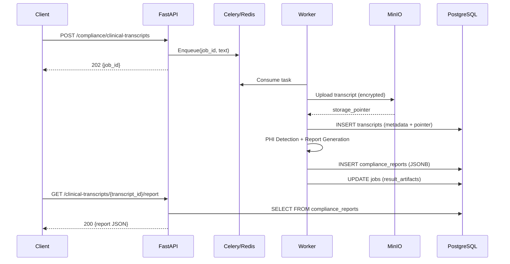

# Compliance Report Artifacts Implementation

This document describes the implemented compliance report persistence and retrieval as specified in [component_compliance_report_artifacts.md](./component_compliance_report_artifacts.md).

**Status**: Implemented ✅

---

## Overview

The compliance module now persists transcripts and compliance reports as durable artifacts in PostgreSQL. Reports are stored as JSONB and can be retrieved via a REST endpoint. No raw PHI is stored in the database—transcript text is encrypted in MinIO and referenced by pointer.

This design provides:
- **Stability**: Transcript and report IDs are persistent, enabling retrieval after job completion
- **PHI Safety**: Raw text stored encrypted in MinIO; only metadata and pointers in Postgres
- **Auditability**: Clear lineage from upload → job → transcript → report
- **Tenant Scoping**: All records include `tenant_id` and `project_id`

---

## Architecture Flow



---

## Database Schema

Two new tables added to [init-db.sql](../db/init-db.sql):

### `transcripts` Table

Stores transcript metadata and pointer to encrypted content:

```sql
CREATE TABLE IF NOT EXISTS transcripts (
    transcript_id UUID PRIMARY KEY,
    tenant_id VARCHAR(255) NOT NULL,
    project_id VARCHAR(255) NOT NULL,
    filename VARCHAR(512),
    storage_pointer TEXT NOT NULL,   -- MinIO path to encrypted text
    byte_size BIGINT,
    text_length INT,
    file_hash VARCHAR(64),           -- SHA-256 for deduplication
    created_at TIMESTAMPTZ DEFAULT NOW(),
    created_by_job_id UUID
);
```

### `compliance_reports` Table

Stores report metrics and JSONB content:

```sql
CREATE TABLE IF NOT EXISTS compliance_reports (
    report_id UUID PRIMARY KEY,
    tenant_id VARCHAR(255) NOT NULL,
    project_id VARCHAR(255) NOT NULL,
    transcript_id UUID NOT NULL REFERENCES transcripts(transcript_id),
    overall_risk_level VARCHAR(20),
    total_phi_detected INT DEFAULT 0,
    total_violations INT DEFAULT 0,
    report_json JSONB,              -- Contains sections, findings, recommendations
    schema_version VARCHAR(50) DEFAULT '1.0',
    generated_at TIMESTAMPTZ DEFAULT NOW(),
    created_by_job_id UUID
);
```

---

## Implementation Details

### Repository Services

Two repository services provide CRUD operations:

**Source**: [transcript_repository.py](../app/compliance/services/transcript_repository.py)

```python
class TranscriptRepository:
    def create(*, tenant_id, project_id, filename, storage_pointer, ...) -> str
    def get_by_id(transcript_id: str) -> dict | None
    def get_by_job_id(job_id: str) -> dict | None
```

**Source**: [report_repository.py](../app/compliance/services/report_repository.py)

```python
class ReportRepository:
    def create(*, tenant_id, project_id, transcript_id, report, job_id) -> str
    def get_by_id(report_id: str) -> dict | None
    def get_by_transcript_id(transcript_id: str) -> dict | None
```

### Orchestrator Persistence

The `ComplianceOrchestrator` now persists artifacts during analysis:

**Source**: [orchestrator.py](../app/compliance/services/orchestrator.py)

1. Upload transcript to MinIO and create transcript record
2. Run PHI detection and compliance analysis
3. Persist report to `compliance_reports` table
4. Return stable `transcript_id` and `report_id`

```python
# Key implementation (analyze_transcript method)
storage_pointer = self.storage.upload(content=content_bytes, ...)
self.transcript_repo.create(tenant_id=tenant_id, storage_pointer=storage_pointer, ...)
report_id = self.report_repo.create(transcript_id=transcript_id, report=report, ...)
```

### API Endpoints

**Source**: [routes.py](../app/compliance/routes.py)

#### `GET /compliance/clinical-transcripts/{transcript_id}/report`

Retrieves the persisted compliance report:

```python
@router.get("/clinical-transcripts/{transcript_id}/report")
async def get_compliance_report_endpoint(transcript_id: str):
    repo = get_report_repository()
    report = repo.get_by_transcript_id(transcript_id)
    if not report:
        raise HTTPException(status_code=404, detail="No compliance report found")
    return ComplianceReportResponse(...)
```

#### `GET /compliance/clinical-transcripts/job/{job_id}`

Updated to return stable IDs from `result_artifacts`:

```python
result_artifacts = job.get("result_artifacts")
transcript_id = result_artifacts.get("transcript_id")
report_id = result_artifacts.get("report_id")
```

---

## PHI Safety

No raw PHI is stored in PostgreSQL:

| Data | Storage Location | PHI? |
|:-----|:-----------------|:----:|
| Raw transcript text | MinIO (encrypted) | ✅ Yes |
| `transcripts.storage_pointer` | PostgreSQL | ❌ No (just path) |
| `compliance_reports.report_json` | PostgreSQL | ❌ No (counts + recommendations) |

The report contains:
- Category counts (e.g., "NAME: 9 instances")
- Severity levels
- Generic findings and recommendations

It does **not** contain detected PHI values, character offsets, or raw text.

---

## Testing

### Unit Tests

**65 total compliance tests** including:

| Test File | Coverage |
|:----------|:---------|
| `test_transcript_repository.py` | 7 tests: create, get_by_id, get_by_job_id |
| `test_report_repository.py` | 7 tests: create, get_by_id, get_by_transcript_id |
| `test_orchestrator.py` | Verifies persistence calls |

Run tests:
```bash
uv run pytest tests/app/compliance/ -v
```

### Manual Verification

```bash
# 1. Upload transcript
curl -X POST "http://localhost:8082/compliance/clinical-transcripts?project_id=test" \
  -F "file=@sample_transcript.txt"
# Returns: {"job_id": "...", "status": "pending"}

# 2. Check job status (after worker completes)
curl "http://localhost:8082/compliance/clinical-transcripts/job/{job_id}"
# Returns: {"transcript_id": "...", "report_id": "...", "status": "completed"}

# 3. Retrieve report
curl "http://localhost:8082/compliance/clinical-transcripts/{transcript_id}/report"
# Returns: {"report_id": "...", "overall_risk_level": "HIGH", "sections": [...]}
```

---

## Files Changed

| File | Change Type | Description |
|:-----|:------------|:------------|
| `db/init-db.sql` | Modified | Added `transcripts` and `compliance_reports` tables |
| `app/compliance/services/transcript_repository.py` | New | Repository for transcript records |
| `app/compliance/services/report_repository.py` | New | Repository for compliance reports |
| `app/compliance/services/orchestrator.py` | Modified | Added persistence during analysis |
| `app/compliance/routes.py` | Modified | Implemented report retrieval endpoint |
| `app/compliance/schemas.py` | Modified | Added `transcript_id`, `report_id` to job status |
| `app/workers/decorators.py` | Modified | Store IDs in `result_artifacts`, fix API calls |
| `tests/app/compliance/test_orchestrator.py` | Modified | Added mocks for new dependencies |
| `tests/app/compliance/test_transcript_repository.py` | New | Repository unit tests |
| `tests/app/compliance/test_report_repository.py` | New | Repository unit tests |

---

## Future Work (P1)

- [ ] Store `model_id` / `prompt_version` for provenance
- [ ] Versioned report schema with migration support
- [ ] Redacted transcript storage for RAG indexing
- [ ] Tenant-scoped access control on report retrieval
