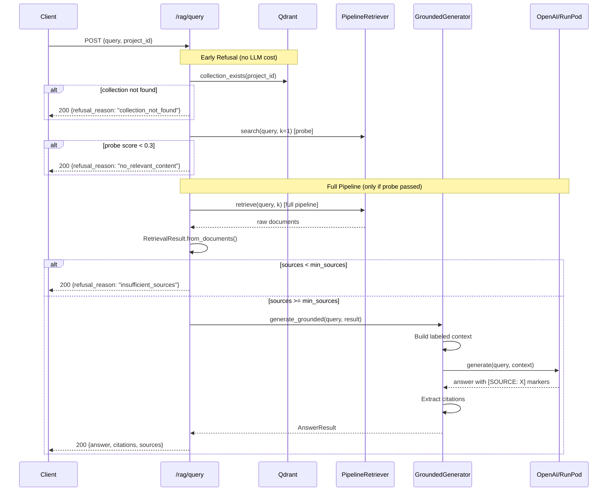

# Grounded RAG Contract Implementation

This document describes the implemented grounded RAG contract as specified in [component_grounded_rag_contract.md](./component_grounded_rag_contract.md).

**Status**: Implemented ✅

---

## Overview

The RAG module now enforces citation-based grounding. The system refuses to answer when sources are insufficient and validates that generated answers reference retrieved documents.

This design provides:
- **Refusal on Insufficient Sources**: If retrieval returns fewer than `min_sources`, the system refuses to speculate
- **Citation Enforcement**: Answers must reference source IDs; citations are extracted and validated
- **Injection Hygiene**: Retrieved content is labeled as data, not instructions
- **Transparency**: API responses include `citations` and `refusal_reason` fields

---

## Architecture Flow



---

## Domain Models

**Source**: [grounding.py](../app/rag/domain/grounding.py)

```python
class RetrievalSource(BaseModel):
    source_id: str
    content_snippet: str
    score: float
    metadata: dict

class RetrievalResult(BaseModel):
    sources: list[RetrievalSource]
    query_analysis: dict
    is_sufficient: bool

class AnswerResult(BaseModel):
    answer_text: str
    citations: list[str]
    refusal_reason: str | None
```

---

## Implementation Details

### GroundedGenerator

**Source**: [grounded_generator.py](../app/rag/services/grounded_generator.py)

| Behavior | Description |
|:---------|:------------|
| Refusal | Returns `AnswerResult.refusal("insufficient_sources")` when sources < threshold |
| Labeled Context | Each source prefixed with `[SOURCE: {id}]` |
| Injection Defense | System prompt includes rules to ignore directives in content |
| Citation Extraction | Regex parses `[SOURCE: X]` from answer, validates against sources |

### API Changes

**Source**: [routes.py](../app/rag/routes.py)

Updated `QueryResponse`:
```python
class QueryResponse(BaseModel):
    answer: str
    sources: list[SourceDocument]
    citations: list[str]       # NEW
    refusal_reason: str | None # NEW
    query: str
```

New request field:
```python
min_sources: int = Field(default=1, ge=0, le=10)
```

---

## Testing

**13 tests** covering:

| Test Class | Coverage |
|:-----------|:---------|
| `TestRetrievalSource` | Model creation |
| `TestRetrievalResult` | Factory, sufficiency, graph exclusion |
| `TestAnswerResult` | Refusal factory |
| `TestGroundedGeneratorRefusal` | Empty sources, threshold logic |
| `TestGroundedGeneratorCitations` | Extraction, validation |
| `TestGroundedGeneratorContext` | Labeled sources, injection defense |
| `TestRefusalReasonConstants` | Constant values, custom reasons |

Run tests:
```bash
uv run pytest tests/app/rag/test_grounded_generator.py -v
```

---

## Files Changed

| File | Change | Description |
|:-----|:-------|:------------|
| `app/rag/domain/__init__.py` | New | Package exports |
| `app/rag/domain/grounding.py` | New | Domain models + refusal reason constants |
| `app/rag/services/grounded_generator.py` | New | Citation-enforced generator |
| `app/rag/factory.py` | Modified | Added `get_grounded_generator()`, `collection_exists()` |
| `app/rag/routes.py` | Modified | Grounded generation, early refusal checks |
| `tests/app/rag/test_grounded_generator.py` | New | 13 unit tests |

---

## Usage

```bash
# Query with grounding (default: min_sources=1)
curl -X POST "http://localhost:8081/rag/query" \
  -H "Content-Type: application/json" \
  -d '{"query": "What are PHI identifiers?", "project_id": "hipaa-docs"}'

# Response with citations
{
  "answer": "PHI identifiers include... [SOURCE: abc-123]",
  "sources": [...],
  "citations": ["abc-123"],
  "refusal_reason": null,
  "query": "..."
}

# Non-existent project → early refusal (no LLM tokens used)
{
  "answer": "I don't have enough information...",
  "sources": [],
  "citations": [],
  "refusal_reason": "collection_not_found",
  "query": "..."
}

# Irrelevant query → early refusal (probe failed, no query expansion)
{
  "refusal_reason": "no_relevant_content"
}
```

---

## Future Work (P1)

- [ ] Citation density requirements (min citations per paragraph)
- [ ] Graph-expanded sources as first-class citations
- [ ] Evaluation harness for grounding metrics
- [ ] Strip citation markers option (clean answer text)
