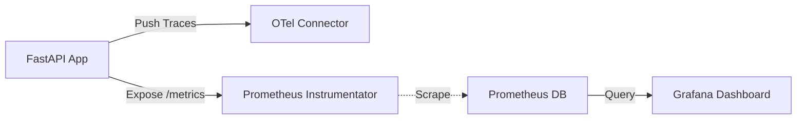
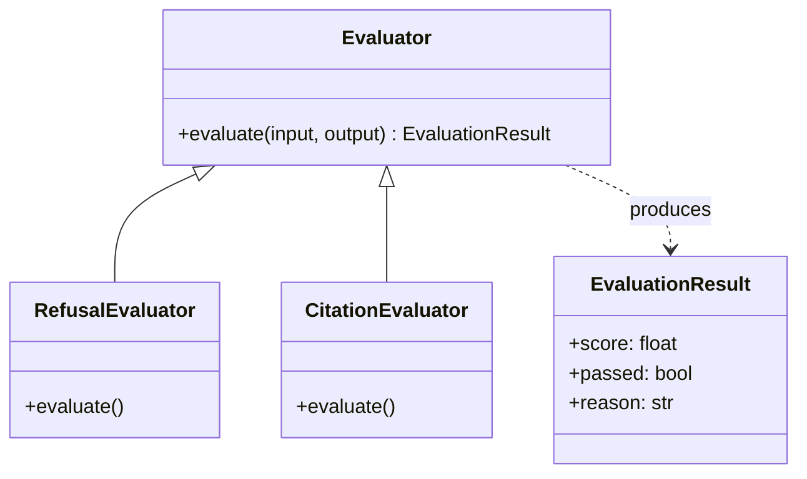

# Observability & Evaluations Implementation

This document describes the implemented observability stack (OpenTelemetry, Prometheus, Grafana) and the evaluation harness for Shorui AI.

**Status**: Implemented ✅

---

## Overview

The system now has a complete observability layer providing "Golden Signals" (Latency, Traffic, Errors) for the API and a robust framework for evaluating AI model performance.

**Key Components**:
- **Telemetry Service**: Centralized OpenTelemetry configuration.
- **Metrics Storage**: Prometheus scraping application metrics.
- **Visualization**: Grafana with auto-provisioned dashboards.
- **Evaluation Harness**: Extensible framework for running offline model evaluations.

---

## Architecture

### Observability Pipeline



### Evaluation Harness



---

## Core Module (`shorui_core`)

### 1. Telemetry Service (`shorui_core/infrastructure/telemetry.py`)

Singleton service that manages OpenTelemetry providers and Prometheus instrumentation.

```python
class TelemetryService:
    def setup(self):
        # 1. Configure Tracing (OTLP/Console)
        self.tracer_provider = TracerProvider(resource=resource)
        
        # 2. Configure Metrics (Prometheus Request Reader)
        # ...

    def instrument_app(self, app):
        # 1. OTel Traces
        FastAPIInstrumentor.instrument_app(app, ...)
        
        # 2. HTTP Metrics (Requests, Latency, Errors)
        from prometheus_fastapi_instrumentator import Instrumentator
        Instrumentator().instrument(app).expose(app)
```

### 2. Evaluation Protocol (`shorui_core/evals/`)

Defined in `base.py` and implemented in `evaluators.py`.

```python
class BaseEvaluator(ABC):
    @abstractmethod
    def evaluate(self, input_text: str, model_output: str) -> EvaluationResult:
        """Evaluate a single input/output pair."""
```

---

## Integration

### API (`app/main.py`)

Telemetry is initialized at startup, and the `/metrics` endpoint is effectively mounted by the `Instrumentator`.

```python
# Initialize Telemetry
setup_telemetry()

app = FastAPI(...)

# Instrument FastAPI app
TelemetryService().instrument_app(app)
```

### Infrastructure (`docker-compose.yml`)

Two new services were added to the stack:

1.  **Prometheus (`:9090`)**: Scrapes `app:8082/metrics`.
2.  **Grafana (`:3000`)**: Visualizes data.

**Provisioning**:
Grafana is configured to automatically load:
- **Datasource**: Connection to Prometheus (UID: `P1809F7CD0C75ACF3`).
- **Dashboards**: Default "Shorui AI Overview" dashboard.

---

## Verification

### Dashboards
- **URL**: `http://localhost:3000`
- **Creds**: `admin` / `admin`
- **Metrics**: Throughput (RPS), Error Rate (%), Latency (p95/p99).

### Evaluations
Run the evaluation harness via CLI:

```bash
# Run evaluations (using mock data or real inference)
python app/scripts/run_evals.py
```
