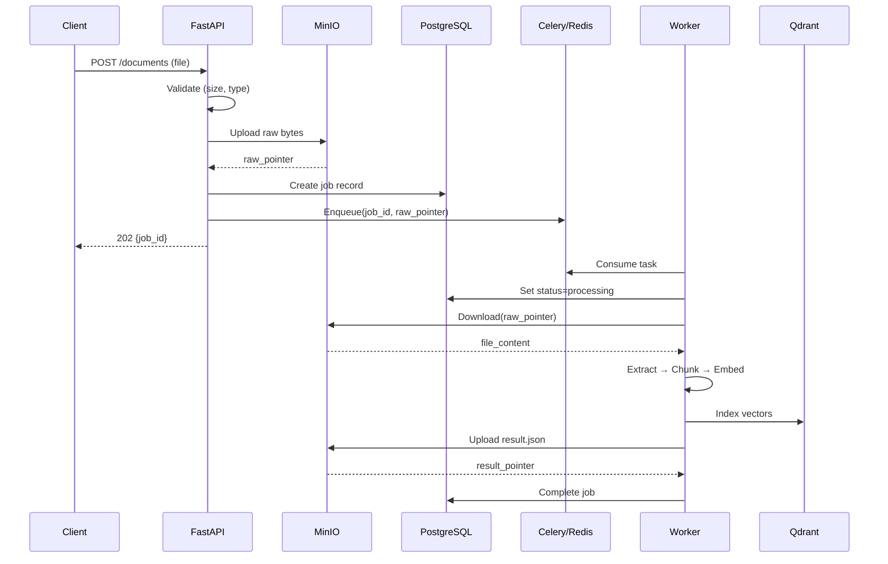

# Pointer-Based Ingestion Implementation

This document describes the implemented pointer-based ingestion architecture as specified in [component_pointer_based_ingestion.md](./component_pointer_based_ingestion.md).

**Status**: Implemented ✅

---

## Overview

The ingestion system uses a pointer-based architecture where raw document bytes are never passed through the Celery task queue. Instead, documents are uploaded to object storage first, and only storage pointers are passed to workers.

This design provides:
- **Scalability**: Large files don't bottleneck the message broker
- **PHI Safety**: Reduced exposure surface for sensitive content
- **Idempotency**: Stable artifact references enable reliable replay
- **Auditability**: Clear lineage from upload to indexed content

---

## Architecture Flow



---

## Implementation Details

### API Layer

The upload endpoint handles validation and storage before enqueueing:

-   **Endpoint**: `POST /ingest/documents`
-   **Response**: `202 Accepted` with `job_id`
-   **Limits**: 20MB max, PDF/TXT only

**Source**: [documents.py](../app/ingestion/routes/documents.py)

```python
# Key implementation (lines 121-133)
try:
    raw_pointer = storage_service.upload(
        content=file_content,
        filename=filename,
        tenant_id=tenant_id,
        project_id=project_id,
        bucket=storage_service.raw_bucket,
        prefix="raw",
    )
except Exception as e:
    logger.error(f"[{request_id}] Storage upload failed: {type(e).__name__}")
    raise HTTPException(status_code=503, detail="Storage temporarily unavailable")
```

### Celery Task

The worker task receives pointers, not bytes:

-   **Task**: `process_document`
-   **Input**: `job_id`, `raw_pointer`, `tenant_id`, `project_id`, metadata
-   **Forbidden**: `file_content: bytes` in task args

**Source**: [tasks.py](../app/workers/tasks.py)

```python
# Task signature (lines 20-36)
def process_document(
    self,
    job_id: str,
    tenant_id: str,
    project_id: str,
    raw_pointer: str,        # Pointer, not bytes
    filename: str,
    content_type: str,
    document_type: str = "general",
    ...
)
```

### Storage Service

Storage paths enforce tenant/project namespacing:

-   **Pattern**: `{bucket}/{prefix}/{tenant_id}/{project_id}/{uuid}_{filename}`
-   **Buckets**: `raw` (uploads), `processed` (results)

**Source**: [storage.py](../app/ingestion/services/storage.py)

```python
# Path construction (lines 82-83)
components = [prefix, tenant_id, project_id, f"{unique_id}_{filename}"]
object_name = "/".join([c for c in components if c])
```

### Orchestrator

Downloads from storage, routes to processor, uploads result artifact:

**Source**: [orchestrator.py](../app/ingestion/services/orchestrator.py)

-   `IngestionOrchestrator.process()` - Main entry point
-   `GeneralDocumentProcessor` - PDFs, TXT files
-   `HipaaRegulationProcessor` - HIPAA regulations

### Job Ledger

Tracks job lifecycle with artifact pointers:

**Source**: [job_ledger.py](../app/ingestion/services/job_ledger.py)

-   `create_job()` - Records `raw_pointer`, `idempotency_key`
-   `complete_job()` - Records `result_pointer`, `items_indexed`
-   `check_idempotency()` - Prevents duplicate processing

---

## Data Model

### Jobs Table

| Column | Type | Description |
|:---|:---|:---|
| `job_id` | UUID | Primary key |
| `tenant_id` | VARCHAR | Tenant namespace |
| `project_id` | VARCHAR | Project identifier |
| `job_type` | VARCHAR | e.g., `ingestion_document` |
| `status` | VARCHAR | `pending`, `processing`, `completed`, `failed`, `skipped` |
| `raw_pointer` | TEXT | Storage path to raw upload |
| `result_pointer` | TEXT | Storage path to result JSON |
| `processed_pointer` | TEXT | Storage path to processed artifact |
| `idempotency_key` | VARCHAR | SHA-256 hash for deduplication |
| `items_indexed` | INT | Count of indexed chunks |

**Source**: [init-db.sql](../db/init-db.sql) (lines 5-30)

### Artifacts Table

| Column | Type | Description |
|:---|:---|:---|
| `artifact_id` | UUID | Primary key |
| `tenant_id` | VARCHAR | Tenant namespace |
| `project_id` | VARCHAR | Project identifier |
| `artifact_type` | VARCHAR | `raw_upload`, `ingestion_result`, etc. |
| `storage_pointer` | TEXT | Full storage path |
| `sha256` | VARCHAR | Content hash |
| `created_by_job_id` | UUID | Owning job reference |

**Source**: [init-db.sql](../db/init-db.sql) (lines 38-51)

---

## Idempotency

Duplicate uploads are detected via content hashing:

```
idempotency_key = SHA-256(content_hash + tenant_id + project_id + document_type + content_type)
```

**Behavior**:
- If existing job is `completed` → Return `skipped` with `existing_job_id`
- If existing job is `processing` → Return existing job reference

**Source**: [job_ledger.py](../app/ingestion/services/job_ledger.py) (lines 328-344)

---

## Error Handling

### Storage Failures (API)

If upload fails, the request is rejected with `503`:

```python
except Exception as e:
    logger.error(f"[{request_id}] Storage upload failed: {type(e).__name__}")
    raise HTTPException(status_code=503, detail="Storage temporarily unavailable")
```

### Worker Failures

Failed jobs are recorded in the ledger and DLQ:

```python
except Exception as exc:
    ledger_service.fail_job(job_id, error=str(exc))
    ledger_service.add_to_dlq(job_id, error=str(exc), traceback=None)
    raise
```

**Source**: [tasks.py](../app/workers/tasks.py) (lines 94-97)

---

## PHI-Safe Logging

Filenames are treated as sensitive and **not logged**:

| Before | After |
|:---|:---|
| `Uploading {filename} to...` | `Uploading document to...` |
| `Ingesting document: {filename}` | `Ingesting document for project...` |
| `No text extracted from {filename}` | `No text extracted from document` |

**Affected files**:
- [storage.py](../app/ingestion/services/storage.py)
- [orchestrator.py](../app/ingestion/services/orchestrator.py)
- [document_ingestion_service.py](../app/ingestion/services/document_ingestion_service.py)
- [decorators.py](../app/workers/decorators.py)
- [compliance/orchestrator.py](../app/compliance/services/orchestrator.py)
- [privacy_extraction.py](../app/compliance/services/privacy_extraction.py)

---

## API Contracts

### POST /ingest/documents

**Request**: Multipart form with file and metadata

**Response** (202):
```json
{
  "job_id": "uuid",
  "message": "Document queued for processing",
  "status": "pending"
}
```

**Source**: [schemas.py](../app/ingestion/schemas.py) - `UploadResponse`

### GET /ingest/documents/{job_id}/status

**Response**:
```json
{
  "job_id": "uuid",
  "status": "completed",
  "progress": 100,
  "result": {
    "result_pointer": "processed/results/uuid.json",
    "items_indexed": 42,
    "collection_name": "project_my-project"
  }
}
```

**Source**: [schemas.py](../app/ingestion/schemas.py) - `JobStatus`, `JobResult`

---

## Configuration

| Setting | Default | Description |
|:---|:---|:---|
| `MINIO_BUCKET_RAW` | `raw` | Raw upload bucket |
| `MINIO_BUCKET_PROCESSED` | `processed` | Result artifact bucket |
| `USE_LOCAL_STORAGE` | `False` | Use filesystem (dev only) |

**Source**: [config.py](../shorui_core/config.py)

---

## Testing

All tests updated for pointer-based API:

-   [test_storage_service.py](../tests/app/ingestion/test_storage_service.py) - Storage with tenant_id
-   [test_orchestrator.py](../tests/app/ingestion/test_orchestrator.py) - Pointer-based flow
-   [test_job_ledger_service.py](../tests/app/ingestion/test_job_ledger_service.py) - New API signature
-   [test_celery_tasks.py](../tests/app/workers/test_celery_tasks.py) - Task parameters

**Run tests**:
```bash
uv run pytest tests/app/ingestion/ tests/app/workers/ -v
```

---

## Compliance Checklist

| Requirement | Status | Evidence |
|:---|:---:|:---|
| No raw bytes in Celery | ✅ | Task receives `raw_pointer` |
| Tenant isolation | ✅ | Paths: `{tenant}/{project}/...` |
| PHI-safe logging | ✅ | No filename in logs |
| Hard limits | ✅ | 20MB, PDF/TXT allowlist |
| Storage failures fatal | ✅ | 503 on upload failure |
| DLQ safety | ✅ | Only job_id + error string |
| Idempotency | ✅ | SHA-256 content hashing |
