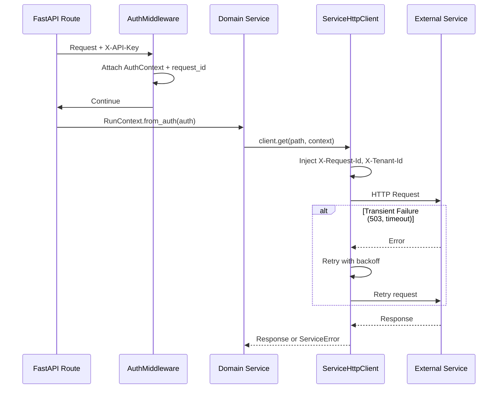

# Service Runtime Implementation

This document describes the implemented service runtime layer as specified in [component_service_runtime.md](./component_service_runtime.md).

**Status**: Implemented ✅ (P1 Requirements)

---

## Overview

The service runtime layer provides shared infrastructure for reliability and operational safety across all modules. It standardizes HTTP clients, error handling, retry policies, and correlation ID propagation.

This design provides:
- **RunContext**: Request-scoped context with correlation IDs and tenant info
- **ServiceError**: Structured errors with retry classification
- **ServiceHttpClient**: Pooled async HTTP client with auto header injection
- **RetryPolicy**: Configurable exponential backoff with jitter

---

## Architecture Flow



---

## Implementation Details

### RunContext

**Source**: [context.py](../shorui_core/runtime/context.py)

Carries correlation IDs and tenant information across service boundaries:

```python
from shorui_core.runtime import RunContext

# From HTTP request (via AuthContext)
ctx = RunContext.from_auth(auth, project_id="my-project")

# For background worker
ctx = RunContext.for_worker(
    tenant_id="tenant-abc",
    project_id="project-123", 
    job_id="job-uuid",  # Used as request_id
)

# Get headers for outbound calls
headers = ctx.get_headers()
# {"X-Request-Id": "...", "X-Tenant-Id": "...", "X-Project-Id": "..."}
```

### ServiceError

**Source**: [errors.py](../shorui_core/runtime/errors.py)

Standardized errors with retry classification:

| Error Type | `retryable` | Use Case |
|:-----------|:-----------:|:---------|
| `ServiceError` | Configurable | Base class |
| `RetryableError` | `True` | Timeouts, 503, rate limits |
| `TerminalError` | `False` | 400, 401, 403, 404 |

```python
from shorui_core.runtime import RetryableError, TerminalError, ErrorCode

# Transient failure - caller should retry
raise RetryableError(
    code=ErrorCode.SERVICE_UNAVAILABLE,
    message_safe="Service temporarily unavailable",
)

# Permanent failure - do not retry
raise TerminalError(
    code=ErrorCode.NOT_FOUND,
    message_safe="Resource not found",
)
```

### ServiceHttpClient

**Source**: [http_client.py](../shorui_core/runtime/http_client.py)

Pooled async HTTP client with automatic header injection and retry:

```python
from shorui_core.runtime import ServiceHttpClient, RunContext

client = ServiceHttpClient(
    base_url="http://rag-service:8082",
    timeout=30.0,
)

async with client:
    response = await client.get("/rag/search", context, params={"q": "test"})
    # Automatically includes X-Request-Id, X-Tenant-Id, X-Project-Id
    # Retries on 429, 502, 503, 504, timeouts, connection errors
```

### RetryPolicy

**Source**: [retry.py](../shorui_core/runtime/retry.py)

Configurable retry behavior with exponential backoff:

```python
from shorui_core.runtime import RetryPolicy, with_retry

policy = RetryPolicy(
    max_attempts=5,
    base_delay=1.0,
    max_delay=30.0,
    jitter=True,
)

@with_retry(policy)
async def fetch_data():
    # Function will retry on RetryableError
    ...
```

---

## Configuration

Added to [config.py](../shorui_core/config.py):

| Setting | Default | Description |
|:--------|:--------|:------------|
| `DEFAULT_TIMEOUT` | `30.0` | Default HTTP timeout in seconds |
| `DEFAULT_MAX_RETRIES` | `3` | Default max retry attempts |
| `HTTP_POOL_MAX_CONNECTIONS` | `100` | Max connections in pool |
| `HTTP_POOL_MAX_KEEPALIVE` | `20` | Max keepalive connections |

---

## Testing

**66 unit tests** covering:

| Test File | Tests | Coverage |
|:----------|------:|:---------|
| `test_context.py` | 11 | Creation, factories, modifiers, headers |
| `test_errors.py` | 18 | Error types, codes, serialization |
| `test_retry.py` | 17 | Policy, backoff, decorator |
| `test_http_client.py` | 20 | Headers, errors, retry, methods |

Run tests:
```bash
uv run pytest tests/shorui_core/runtime/ -v
```

---

## Files Changed

| File | Type | Description |
|:-----|:-----|:------------|
| `shorui_core/runtime/__init__.py` | New | Package exports |
| `shorui_core/runtime/context.py` | New | RunContext model |
| `shorui_core/runtime/errors.py` | New | ServiceError hierarchy |
| `shorui_core/runtime/retry.py` | New | RetryPolicy and decorators |
| `shorui_core/runtime/http_client.py` | New | ServiceHttpClient |
| `shorui_core/config.py` | Modified | Runtime settings |
| `tests/shorui_core/runtime/*.py` | New | 66 unit tests |

---

## Usage Examples

### In a Route Handler

```python
from shorui_core.runtime import RunContext, ServiceHttpClient

@router.post("/analyze")
async def analyze(request: Request, auth: AuthContext = Depends(get_auth_context)):
    ctx = RunContext.from_auth(auth, project_id=request.query_params.get("project_id"))
    
    async with ServiceHttpClient("http://compliance:8082") as client:
        response = await client.post("/compliance/check", ctx, json={"text": "..."})
        return response.json()
```

### In a Celery Worker

```python
from shorui_core.runtime import RunContext

@celery.task
def process_document(job_id: str, tenant_id: str, project_id: str, ...):
    ctx = RunContext.for_worker(tenant_id, project_id, job_id)
    
    # All downstream calls will carry correlation IDs
    ...
```

---

## Future Work (P2)

- [ ] Integrate with OpenTelemetry for distributed tracing
- [ ] Add circuit breaker support
- [ ] Expose metrics (latency histograms, retry counts)
- [ ] Migrate existing agent clients to use ServiceHttpClient
