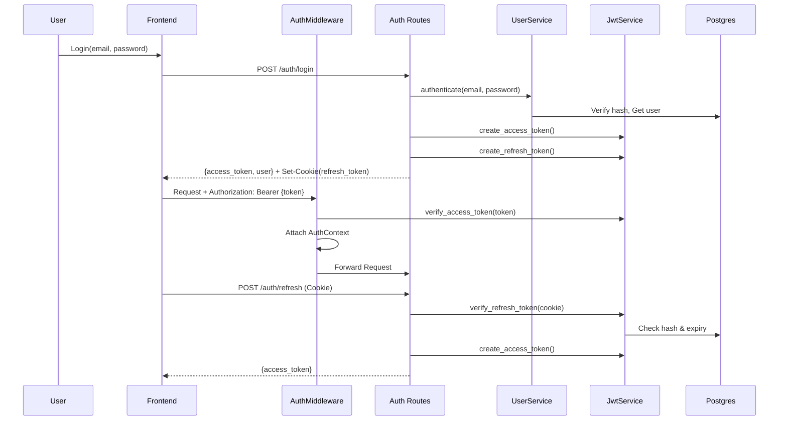

# User Auth Implementation

This document describes the implemented user authentication and session management system as specified in [component_user_auth.md](./component_user_auth.md).

**Status**: Implemented ✅ (P1 Requirements)

---

## Overview

The user auth system enables self-service registration, secure login via email/password, and session management using short-lived JWT access tokens and long-lived HttpOnly refresh cookies.

This design provides:
-   **Security**: bcrypt password hashing, HttpOnly cookies for refresh tokens.
-   **Session Management**: 15-minute access tokens, 1-day renewable sessions.
-   **Tenant Isolation**: Users are strictly bound to a single tenant.
-   **Logout**: Server-side revocation of refresh tokens and invalidation of agent sessions.

---

## Architecture Flow



---

## Database Schema

(Note: Migration scripts are pending creation, but schema is assumed by `UserService`)

### `users` Table
```sql
CREATE TABLE users (
    user_id UUID PRIMARY KEY,
    tenant_id VARCHAR(255) NOT NULL,
    email VARCHAR(255) NOT NULL UNIQUE,
    password_hash VARCHAR(255) NOT NULL,
    role VARCHAR(50) DEFAULT 'user',
    created_at TIMESTAMPTZ,
    last_login_at TIMESTAMPTZ,
    is_active BOOLEAN DEFAULT TRUE
);
```

### `refresh_tokens` Table
```sql
CREATE TABLE refresh_tokens (
    token_id UUID PRIMARY KEY,
    user_id UUID NOT NULL,
    token_hash VARCHAR(64) NOT NULL UNIQUE,
    expires_at TIMESTAMPTZ NOT NULL,
    created_at TIMESTAMPTZ DEFAULT NOW(),
    revoked_at TIMESTAMPTZ
);
```

---

## Implementation Details

### User Service
**Source**: `shorui_core/auth/user_service.py`

-   **Registration**: Creates new Tenant if needed, hashes password (bcrypt cost 12).
-   **Authentication**: Verifies password, updates `last_login_at`.
-   **Tenant Binding**: Generates consistent `tenant_id` from tenant name.

### JWT Service
**Source**: `shorui_core/auth/jwt_service.py`

-   **Access Token**: HS256 JWT, 15 min TTL. Contains `sub` (user_id), `tenant_id`, `scopes`.
-   **Refresh Token**: Random URL-safe string, stored as SHA-256 hash in DB. 24h TTL.
-   **Revocation**: Marks refresh token as revoked in DB.

### Auth Middleware
**Source**: `shorui_core/auth/middleware.py`

-   **Priority**:
    1.  `X-API-Key` (Service-to-Service)
    2.  `Authorization: Bearer <token>` (User Session)
-   **Public Paths**: Skips auth for `/auth/login`, `/auth/register`, `/auth/refresh`.

---

## API Contracts

### Endpoints (Source: `app/auth/routes.py`)

| Method | Endpoint | Auth Required | Description |
|:---|:---|:---|:---|
| `POST` | `/auth/register` | No | Create user & tenant |
| `POST` | `/auth/login` | No | Get JWT + Cookie |
| `POST` | `/auth/refresh` | **Cookie** | Get new JWT |
| `POST` | `/auth/logout` | Yes | Revoke token |
| `GET` | `/auth/me` | Yes | Get current user |

### Frontend Integration

-   **AuthContext**: `frontend/src/context/AuthContext.tsx`
    -   Auto-refreshes token 1 minute before expiry.
    -   Restores session on app mount.
-   **API Client**: `frontend/src/api/authApi.ts`
    -   Uses `credentials: 'include'` for cross-site cookie handling.

---

## Configuration

| Setting | Default | Description |
|:---|:---|:---|
| `JWT_SECRET` | Required | Key for signing access tokens |
| `JWT_ACCESS_TTL` | 900s (15m) | Access token lifetime |
| `JWT_REFRESH_TTL` | 86400s (24h) | Refresh token lifetime |
